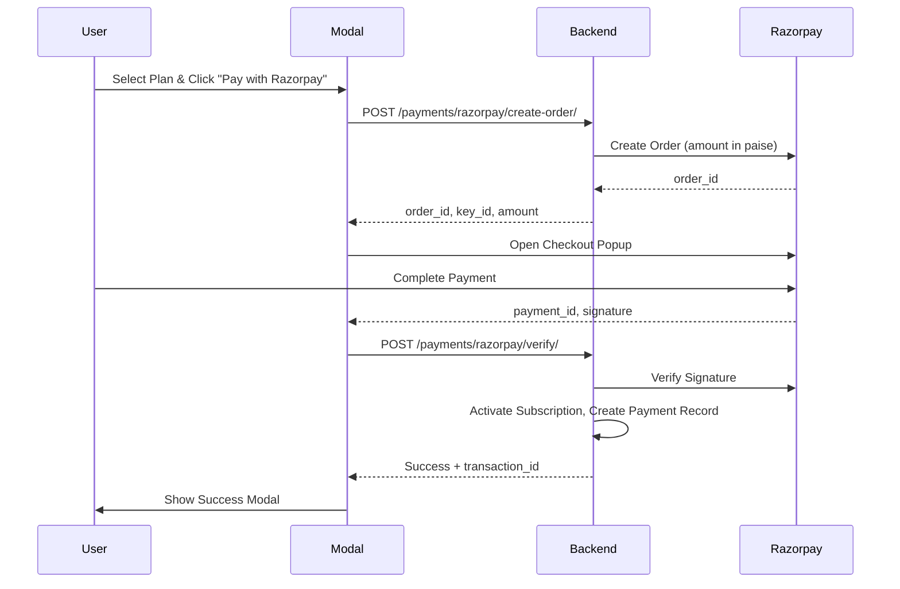

# Razorpay Payment Integration - Walkthrough

## Summary
Integrated Razorpay payment gateway with full backend flow. The old manual payment forms (card/UPI/bank) have been removed and replaced with Razorpay's hosted checkout.

---

## Payment Flow

---

## Changes Made

### Dependencies
- [requirements.txt](file:///Users/karthikyacharapu/Downloads/ticket-management-/requirements.txt) - Added `razorpay==1.4.2`

### Configuration
- [settings.py](file:///Users/karthikyacharapu/Downloads/ticket-management-/mainproject/settings.py) - Added Razorpay credentials

### Backend API
- [payments/views.py](file:///Users/karthikyacharapu/Downloads/ticket-management-/payments/views.py):
  - `razorpay_create_order()` - Creates Razorpay order
  - `razorpay_verify_payment()` - Verifies signature & activates subscription
  - `razorpay_webhook()` - Handles Razorpay webhooks

### URL Routes  
- [payments/urls.py](file:///Users/karthikyacharapu/Downloads/ticket-management-/payments/urls.py) - Added Razorpay routes
- [mainproject/urls.py](file:///Users/karthikyacharapu/Downloads/ticket-management-/mainproject/urls.py) - Included payments app

### Frontend
- [admin_payment_modal.html](file:///Users/karthikyacharapu/Downloads/ticket-management-/templates/admin_payment_modal.html):
  - Removed manual card/UPI/bank input forms
  - Added Razorpay Checkout SDK
  - Button now opens Razorpay popup directly

---

## How to Test

1. **Restart the Django server** (it may need to reload for new settings)
2. **Trigger the payment modal** (login with an expired trial account)
3. **Select a plan** (Basic ₹199 / Standard ₹399 / Premium ₹599)
4. **Click "Pay with Razorpay"** - Razorpay checkout popup opens
5. **Use test credentials**:
   - Card: `4111 1111 1111 1111`
   - Expiry: Any future date
   - CVV: Any 3 digits
   - OTP: `1234` (for test mode)
6. **Verify success modal** appears with transaction ID
7. **Check database** - New Payment record with status `completed`
